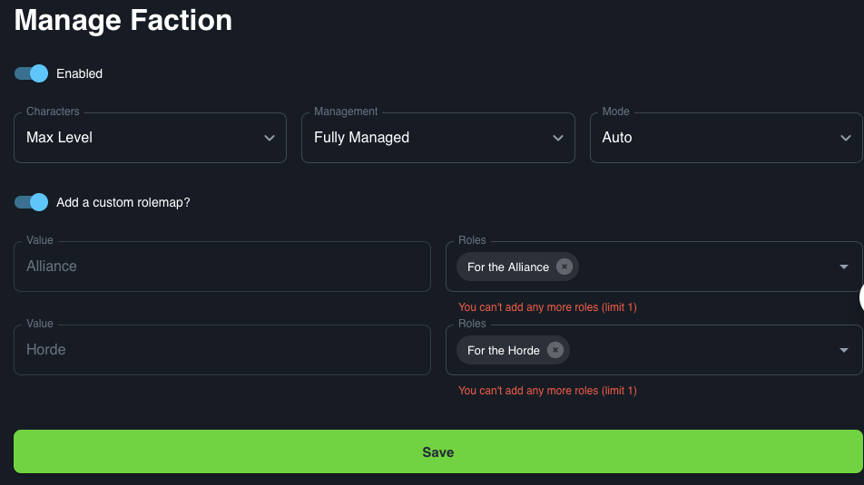

# Faction

The Faction integration assigns roles based on the faction of the characters a player has.

## Use case

This integration would likely be used on larger servers containing lots of player to split chat between factions
## Default roles

By default you will need to create roles in the following format for this integration to work.
```
Alliance
Horde
```

## Custom roles

This integration allows for the setup of custom roles, rather than the roles detailed above. To use this feature you will need set role for each faction

