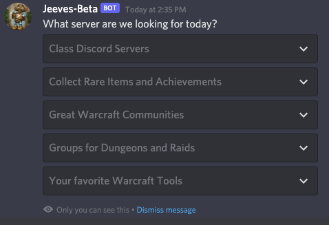

# Servers Command

The Servers command will get Jeeves to give you a list of World of Warcraft related discord servers. It will present you a series of drop downs to select different servers and once a server is selected it will give you an invite link to the server.

To get this list use `/servers` 

