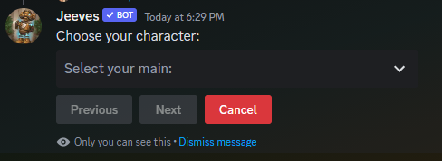
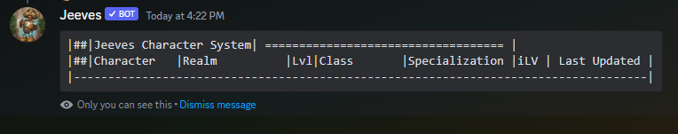

# Characters Command

The Characters command allows you to manage your Synced Character Sheet. This command requires you to have [authorized](authorize.md) Jeeves to look at your Battle.net account already.

***

### Details
  
**Available in DM:** No   
**Can Restrict to a channel:** Yes

* View your characters
* View another users characters
* Mark certain characters as your *Main* or *Hidden*
* Request an update for your characters

This command has multiple sub commands

## Set-Main

The Set-Main sub command allows you to tell Jeeves who your main character is. This allows you to not have to specify a character when you want to add a keystone to your main. Only 1 character can be set as your main at any time. You can change main at any time.

Type `/characters set-main` and Jeeves will prompt you with a drop down to select who your main character is.

## View

The View sub command allows you to see a list of characters by user on the server. Without the optional user parameter Jeeves will display your characters. With the user parameter Jeeves will display the characters of that Discord user.

Type `/characters view` to use this feature. This will show a list of all your max level characters, if you have none max level, the view command will display as blank like below. You can also specify to view a specific user in your server by adding the optional `user:` to the end of the command. `user: @deadlystrike`. When viewing another user's characters, the posted list is public.

## Update

The Update command allows you to queue your characters for update from the cache. For example if Raider.io shows an upgraded score but you have been unable to acquire a role related to the new score even when doing `/roles update`, a `/characters update` should rectify that. If the server or yourself has Jeeves Premium, this command is rather unnecessary.

## Hide and Unhide

The Hide and Unhide sub commands allow you to determine which characters other people can see as belonging to you. 

Type `/characters hide` to begin hiding a character. Jeeves will prompt you with a drop down to select which character you wish to hide.

Type `/characters unhide` to begin unhiding a character. Jeeves will prompt with a drop down to select which character you wish to unhide.
## Ignore and Unignore

The Ignore sub command tells Jeeves to forget the character exists. You will not longer see it as an option in drop downs, you will not get roles based on these characters and they will not appear in the View command. You can ignore all but 1 character on your account.

Type `/characters ignore` to begin ignoring a character. Jeeves will prompt you with a drop down to select which character you wish to ignore.

If you no longer wish a character to be ignored you can use the Unignore command.

Type `/characters unignore` to begin unignoring a character. Jeeves will prompt you with a drop down to select which character you no longer wish to be ignored.

### FAQ

#### Q) Why can I only see 12 characters in `/character view`?
> Its a limitation with how many characters (2000) you can have in a discord message, 12 is the amount we could display comfortably. Rest assured your other characters are still there!
***
