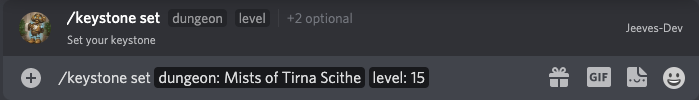

# Keystone Command

Love to share your keystone(s) with your guild members? You can add your keystone(s) to your characters. This command works together with the `/character` command.

## About
  
**Available in DM:** No   
**Can Restrict to a channel:** Yes

This command has multiple sub commands

## Set

The Set command is what tells Jeeves which keystone you have. It has 2 required parameters, the dungeon and the key level, as well as 2 optional parameters, the character and realm

Type `/keystone set` and Discord will prompt you to fill in the required fields.

## View

The View command displays a list of the current keystones that are shared with this server.

Type `/keystone view` to see the list.

## Share and Unshare

The Share and Unshare commands are useful if you want to share your keystone with multiple discord servers you are a part of. By default, the keystone you share is only visible on the server that you added the keystone on. If you are also a member of another discord server using Jeeves the keystone will not show up there.

The `/keystone share` command has one required parameter, the character name, and optionally takes the realm parameter. When you share your characters keystone with another server, you will only need to input that characters keystone once in the future and that keystone will be visible on all servers that you have shared it with.

If in the future you decide you do not want the keystone visible on one of the servers you can type `/keystone unshare` along with the required character parameter, and optional realm, to stop sharing the keystone with that server.

## Board

The keystone board is a [Patreon](../../guides/Supporting-Jeeves.md) feature. It provides a updating display of the keystone on a server. To set it up please see the [Setting Up a Board](../../guides/Setting-Up-A-Board.md) guide.

