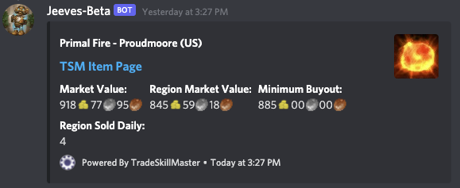

# Pricecheck Command

The pricecheck command is powered by TSM and allows you to check the price of items on the auction house where ever you are. The command has one required parameter `item:` and three optional parameters `realm:`, `region:` and `game-version:`

The `item:` parameter takes the name of the item you are wanting to lookup.

If the `realm:` and `region:` parameters are not supplied the default realm and region from your [server setup](../../configuration/setup.md) or [channel data](../../guides/Channel-Data.md) will be used instead.

The `game-version:` parameter allows you to lookup prices in Retail, Classic or TBC versions of the game. This parameter defaults to Retail if it is not supplied.

`/pricecheck item:Primal Fire`

`/pricecheck item:Primal Fire realm:Proudmoore region:US`

***

