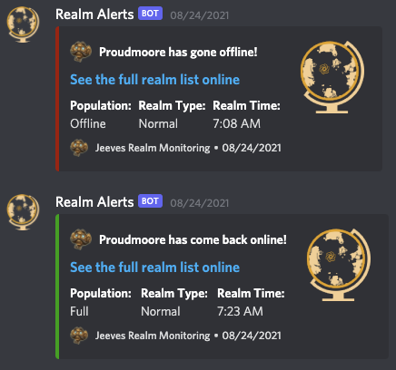

## Realm Alerts Command

### Description
The realm-alerts command allows users to subscribe to alerts for when their specified realm comes online and goes offline.

### Usage
```
/realm-alerts <realm> [region]
```

### Options
- **realm** (required): The realm you want alerts for.
- **region** (optional): Choose a different region. Default is `us`. Choices:
  - `us`: US/OC
  - `eu`: EU
  - `tw`: TW
  - `kr`: KR

### Permissions
- **User**: `ManageWebhooks`
- **Bot**: `ManageWebhooks`

### Examples
- Subscribe to alerts for a specific realm in the default region (US/OC):
  ```
  /realm-alerts realm:Area-52
  ```
- Subscribe to alerts for a specific realm in the EU region:
  ```
  /realm-alerts realm:Tarren-Mill region:eu
  ```

### Notes
- Ensure that Jeeves has the necessary permissions to manage webhooks.
- If a subscription already exists, using the command will delete the existing subscription.
- The bot will reply with a success message when a subscription is created or deleted.

### Example:


