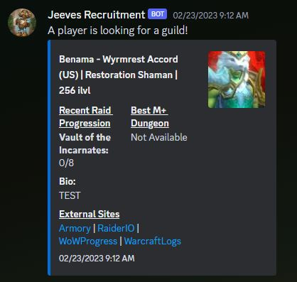

## Recruitment Command

### Description
The `recruitment` command allows users to manage recruitment feeds for finding new raiders looking for a guild. Users can find players, view the status of their recruitment feed, and stop the recruitment feed.

### Usage
```
/recruitment <subcommand> [options]
```

### Subcommands
- **find-players**: Find players that match what you're looking for.
  - **region** (optional): Filter characters only from a specific region. Choices:
    - us: US/OC
    - eu: EU
    - tw: TW
    - kr: KR
  - **realms** (optional): Filter the realms you want to see recruits from (separated by commas).
  - **faction** (optional): Filter potential recruits by faction. Choices:
    - alliance: Alliance
    - horde: Horde
  - **ilvl** (optional): Filter out characters under a specific item level.
  - **prog** (optional): Minimum progression you are looking for (e.g., `5/10M`).
- **view**: Check the status of your recruitment feed.
- **stop**: Stop looking for players. You will no longer get fresh candidates.

### Permissions
- **User**: `ManageWebhooks`
- **Bot**: `ManageWebhooks`

### Examples
- Find players with specific filters:
  ```
  /recruitment find-players region:us realms:Area-52,Illidan faction:horde ilvl:220 prog:5/10M
  ```
- View the status of your recruitment feed:
  ```
  /recruitment view
  ```
- Stop the recruitment feed:
  ```
  /recruitment stop
  ```

### Notes
- Ensure that Jeeves has the necessary permissions to manage webhooks.
- The bot will reply with a success message when a recruitment feed is created, updated, or stopped.
- The bot will display the current filter settings when viewing the status of the recruitment feed.

### Example:

***
