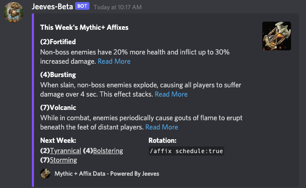
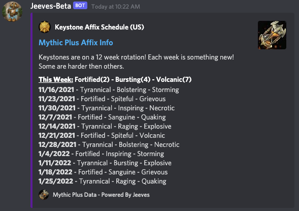

# Affix Command

The Affix command answers that repeating question of what affixes are this week. The command has two optional parameters `region:` and `schedule:`

The `region:` parameter allows you to display the current affixes for a region other than what the default realm and region from your [server setup](../../configuration/setup.md) or [channel data](../../guides/Channel-Data.md) is set to.

The `schedule:` parameter changes the display to show the rotation of affixes rather than this weeks affixes.

`/affix`

`/affix schedule:true`

***