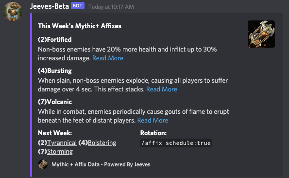
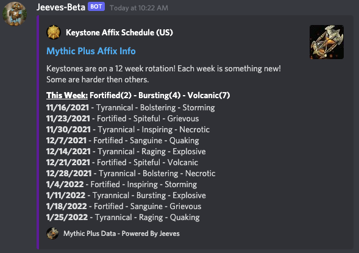

## Affix Command

### Description
The affix command allows users to check the current and upcoming Mythic+ keystone affixes for a specified region.

### Usage
```
/affix [region] [schedule]
```

### Options
- **region** (optional): Choose a different region. Default is `us`. Choices:
  - `us`: US/OC
  - `eu`: EU
  - `tw`: TW
  - `kr`: KR
- **schedule** (optional): View the upcoming schedule. Default is `false`.

### Permissions
- **User**: No special permissions required.
- **Bot**: `EmbedLinks`

### Examples
- Check the current Mythic+ affixes for the default region (US/OC):
  ```
  /affix
  ```
- Check the current Mythic+ affixes for the EU region:
  ```
  /affix region:eu
  ```
- View the upcoming Mythic+ affix schedule for the default region (US/OC):
  ```
  /affix schedule:true
  ```

### Notes
- Ensure that Jeeves has the necessary permission to send embedded messages.
- The command will display the current week's affixes and, if requested, the upcoming schedule for the next few weeks.
- The bot will reply with an error message if it is unable to retrieve data for the current affixes.


### Affix Example:


### Affix Schedule:


***