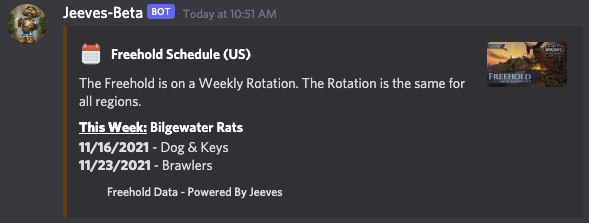
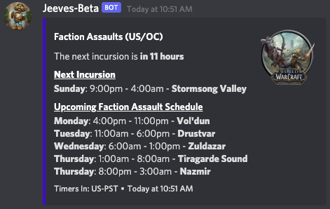
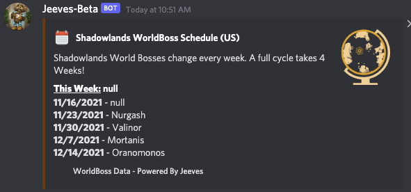

# World Info Battle for Azeroth

The WorldInfo BfA command gives you information about the current events happening in Kul Tiras and Zandalar.

The command has one required parameter `event:` and two optional parameters `schedule:` and `region:`

## Events

### Freehold Boss

The Freehold Boss event shows the schedule of the boss in Freehold.

`/worldinfo bfa event:freehold`

### Faction Assaults

The Faction Assaults event shows the schedule of the faction assaults, showing zone and time of the attacks.

`/worldinfo bfa event:faction-assaults`

### World Boss

The Forld boss event will display the schedule for the weekly rotation for world bosses in Kul Tiras and Zandalar.

`/worldinfo bfa event:worldboss`

## Optional Parameters

The `region:` parameter allows you to display the current affixes for a region other than what the default realm and region from your [server setup](../../configuration/setup.md) or [channel data](../../guides/Channel-Data.md) is set to.
