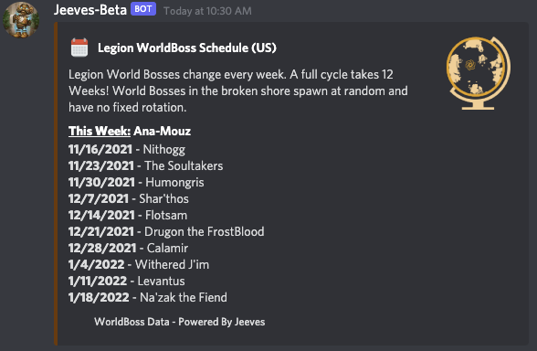

# World Info Legion

The WorldInfo Legion command gives you information about the current events happening in Broken Isles and other Legion areas.

The command has one required parameter `event:` and two optional parameters `schedule:` and `region:`

## Events

The event command has five options to select from.

### Archeology Weekly

The Archeology Weekly event will display the schedule of the Archeology weekly quests

`/worldinfo legion event:Archeology`

### Fishing Friend

The Fishing Friend event will display the schedule of the fishing friend daily quests.

`/worldinfo legion event:fishing`

### Greater Invasion

The Greater Invasion event will display the schedule of the weekly Argus Greater Invasions.

`/worldinfo legion event:greater-invasion`

### Karazhan Opera Event

The Karazan Opera Event will display the schedule of the weekly rotation for the opera event in the Karazhan dungeon (not raid)

`/worldinfo legion event:karazhan`

### World Boss

The world boss event will display the schedule for the weekly rotation for world bosses in Legion.

`/worldinfo legion event:worldboss`

## Optional Parameters

The `region:` parameter allows you to display the current affixes for a region other than what the default realm and region from your [server setup](../../configuration/setup.md) or [channel data](../../guides/Channel-Data.md) is set to.