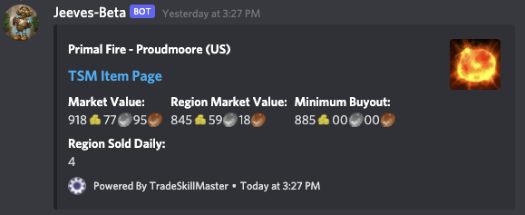

## Pricecheck Command

### Description
The `pricecheck` command allows users to check the price of an item on the auction house for a specified realm and region.

### Usage
```
/pricecheck <item> [region] [realm] [game-version]
```

### Options
- **item** (required): The item you want to price check.
- **region** (optional): Choose a different region. Default is `us`. Choices:
  - `us`: US/OC
  - `eu`: EU
  - `tw`: TW
  - `kr`: KR
- **realm** (optional): Choose a different realm.
- **game-version** (optional): Which version of the game should be checked? Default is `retail`. Choices:
  - `retail`: Retail
  - `classic`: Classic
  - `wrath`: Wrath

### Permissions
- **User**: No special permissions required.
- **Bot**: `EmbedLinks`

### Examples
- Price check an item on the default realm and region (US/OC, Retail):
  ```
  /pricecheck item:Flask of the Currents
  ```
- Price check an item on a specific realm and region:
  ```
  /pricecheck item:Flask of the Currents region:eu realm:Draenor
  ```
- Price check an item on Classic:
  ```
  /pricecheck item:Flask of the Titans game-version:classic
  ```

### Notes
- Ensure that Jeeves has the necessary permission to send embedded messages.
- The bot will reply with an error message if it cannot find the specified item or if there is an issue fetching price information.
- The command will display the market value, region market value, minimum buyout, and other relevant information for the specified item.

### Example:
`/pricecheck item:Primal Fire`

`/pricecheck item:Primal Fire realm:Proudmoore region:US`




***

