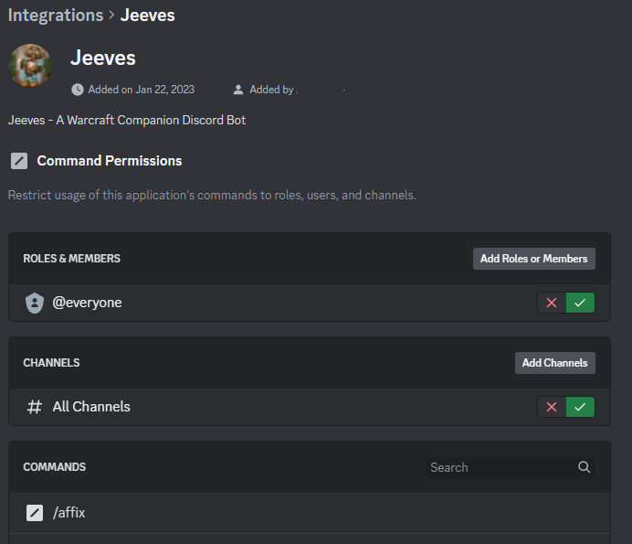
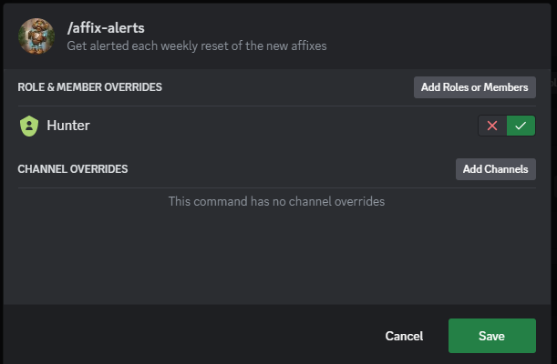

# Command Control

This section doesn't exist on the Dashboard anymore as Discord has its own way to limit commands for users/roles via their interface. Navigate to your Discord Server Settings and find `Integrations` listed under `Apps` on the left. At the bottom of that menu, you will find your bots, clicking on `Manage` will bring you to the command controls. 

You can restrict Members and Roles who can use the slash commands by clicking `Add Roles or Members`. The default should be all. You can also restrict to channels. To restrict certain commands to channels/roles, simply select or search the command you wish to restrict and click the command. You can then specify Role/Member/Channel for the command who can or can't use it.

