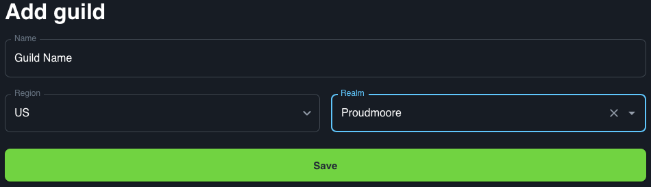

# Dashboard Guild

This section of the Dashboard allows you to set the guild that Jeeves associates with the discord server. 

## Add Guild

To add a guild to your server click Add Guild. This needs the name of the guild, region and realm to be put in. Region will default based on the region of your discord server. In order to link to a guild you will need to have run `!auth` so that Jeeves knows your characters and you need to be either the Guild Master or rank directly below Guild Master in the guild. 

Blizzard does not have an API to advise which ranks are Officer ranks.

## Guild Details

The number of guilds that you can assign to a discord server is dependant on your level of [Patreon support](../guides/Supporting-Jeeves.md).

Once you have linked the guild, you are then able to go into that guild and set the Discord roles to be associated with each rank in the guild. This allows the [Guild integration](/role-management/guild.md) to assign roles to users as they join your server. Examples of characters at each rank are displayed to guide you as to what each rank is. 

Blizzard only supplies rank numbers not rank names as part of the API.