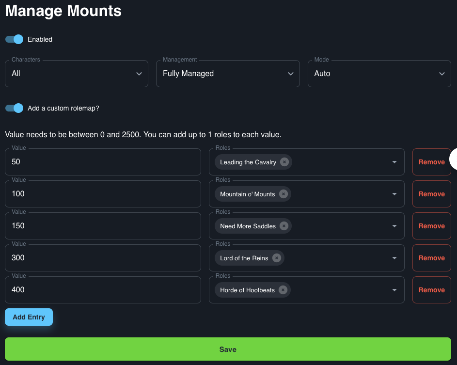

# Mounts

The Mounts integration assigns roles based on the total number of mounts a player has associated to their account.

## Use case

This integration could be used to show who has collected how many mounts.
## Default roles

By default you will need to create roles in the following format for this integration to work.
```
100+ mounts
80 mounts
60 mounts
40 mounts
20 mounts
...
```

## Custom roles

This integration allows for the setup of custom roles, rather than the roles detailed above. To use this feature you will need set a number of mounts and the role you want that value to assign.


