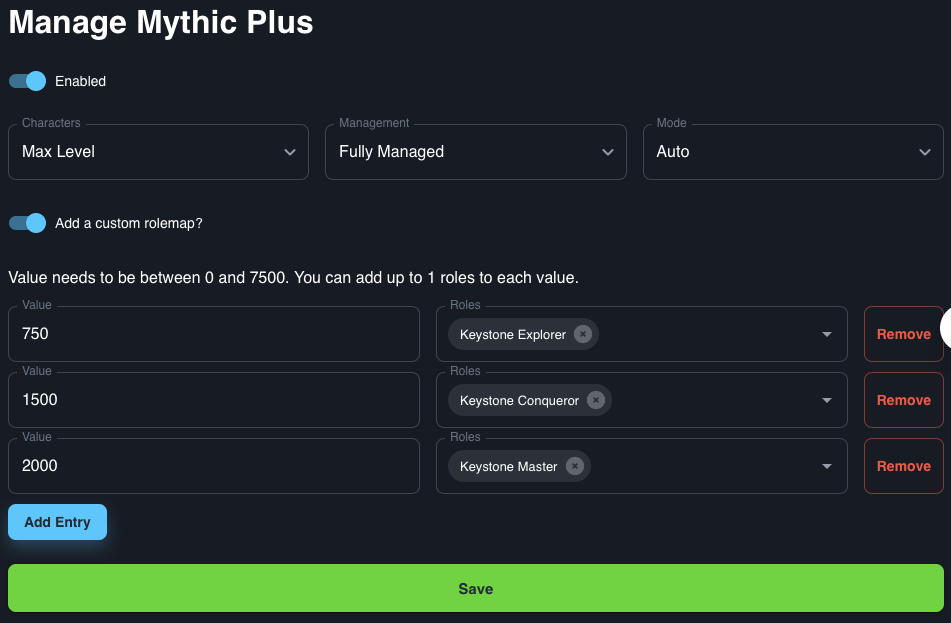

# Mythic Plus

The Mythic Plus integration assigns roles based on the [raider.io](https://raider.io) score a player has. This score is the same as the Mythic+ score in game.

## Use case

This integration could be used to show who the most achieved Mythic Plus players are on your server, potentially opening new discussion channels. `/role-tools mythic-plus sync-colors` is an command that you can use with the Mythic Plus integration to cater the roles you created to the corresponding colors in game. You can use the colors to denote those with higher IO on your Discord Member list to the right. `/role-tools mythic-plus reset-ranks` Will reset the ranks after a Mythic+ Season ends.
## Default roles

By default you will need to create roles in the following format for this integration to work.
```
2500+ Mythic Score
2500+ Mythic+ Score
2500 Mythic Score
2500 Mythic+ Score
Below 200
```
## Custom Rolemap

This integration allows for the setup of custom roles, rather than the roles detailed above. To use this feature you will need to set a raider.io score value and the role you want that value to have. Using this you can create Keystone Explorer, Conqueror and Master roles for your server.


 
