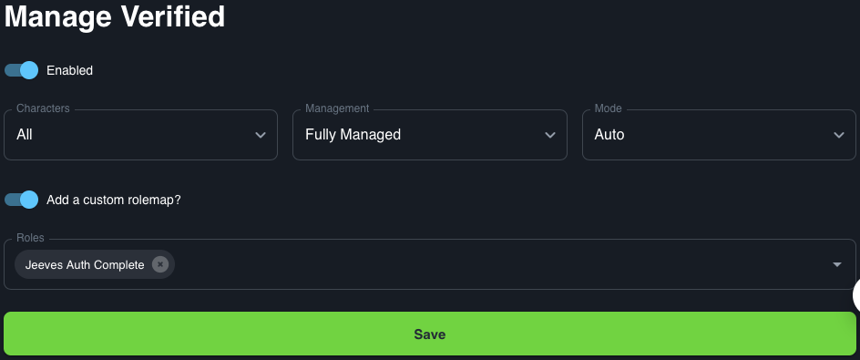

# Verified

The Verified integration assigns the 'Verified' role to all users that have linked their discord account to a battle.net account via `!auth`

## Use case

This integration could be used to show who has verified their account with Jeeves. This could be used to open further channels.
## Default roles

By default you will need to create role in the following format for this integration to work.
```
Verified
```
## Custom roles

This integration allows for the setup of a custom role, rather than the role name detailed above. To use this feature you will need set a role name. 

