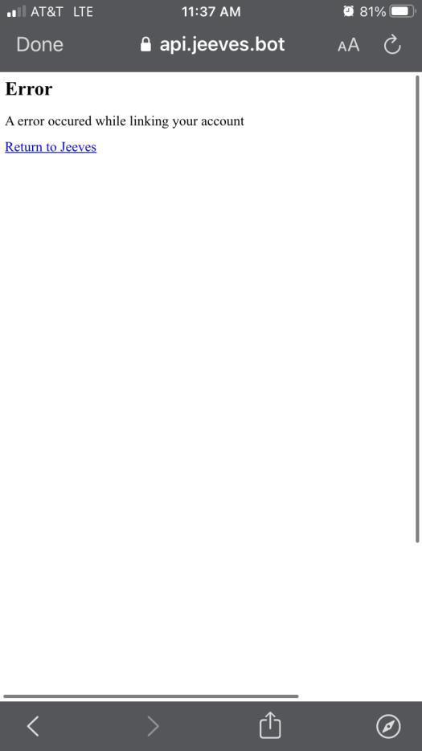
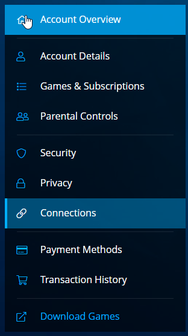
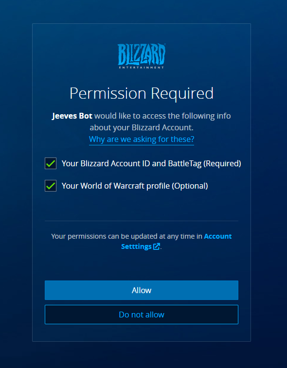

# FAQ

#### Q) Jeeves responds with an empty message.
>You need to enable link preview. User settings > text and images > link preview > enable

#### Q) I keep getting an error when I auth, What do??????.

When authing do you get an error page like the one bellow?

Don't fret!! The fix is easy and can be done in a few steps.

1: Head to your battle.net account settings page and click "connections" in the menue to the left:

2: Scroll down until you see a list of authrized apps and click remove next to Jeeves Bot:

3: Re-auth and make sure the FIRST box remains checked, it isn't optional, and click allow:

