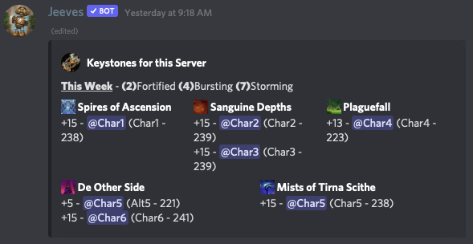

# Setting up your keyboard

This is a Patreon **Only** feature. It creates a static board in a channel that will delete messages everytime it is updated.

***

# Setup
## Step One

You need to make a channel that ``@everyone`` does not have permission to post to and you need to edit the channels topic and add some channel data to it [Channel Data](Channel-Data.md). 

IE: ``--JeevesData Faction: Horde, Region: US``

## Step Two

You need to run ``/keystone board install`` in the channel that you have just set up.  This will tell the bot to post in this channel.

## Use Case

A feature for Discord users to see who is carrying what keys out of game and contact them appropriately. The keystone board channel can be used as the `/keystone set` command channel, which will be promptly cleared of bot command clutter everytime a key is successfully added. You have to restrict the channel from @everyone, but specific roles can be allowed use of the channel to implement this.

## Further Information
* Your members still have to do the [keystone commands](../commands/warcraft/keystone.md) in a valid bot channel to add the keys. Blizzard does not provide an API for us to get this data.

